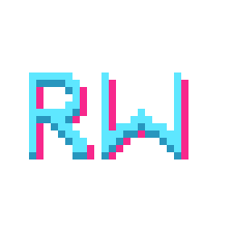

<div align="center">



# RetroWall

### 🎞️ A blazing-fast, 100% free & open-source live video wallpaper engine for Windows

*Your desktop, alive — without the bloat, the subscriptions, or the spyware.*

[](LICENSE)
[](https://github.com/NOXxM/RetroWall)
[-0ea5e9.svg?style=for-the-badge&logo=windows)](https://github.com/NOXxM/RetroWall/releases)

[](https://github.com/NOXxM/RetroWall/releases/latest)
[](https://github.com/NOXxM/RetroWall/actions)
[](https://github.com/NOXxM/RetroWall/releases)
[](https://github.com/NOXxM/RetroWall/stargazers)
[](https://github.com/NOXxM/RetroWall/issues)

[**⬇️ Download**](#-download--quick-setup-60-seconds) · [**✨ Features**](#-why-retrowall) · [**📊 Benchmarks**](#-performance--resource-benchmarks) · [**🛠️ Build**](#️-building-from-source-developers) · [**🗺️ Roadmap**](#️-roadmap)

</div>

---

<div align="center">

### 🖼️ Preview

<!-- Replace the line below with a real screenshot or GIF, e.g. docs/preview.gif -->
> **[ Add a demo GIF or screenshot here → `docs/preview.gif` ]**
>
> *Tip: a 5–10s screen recording of picking a wallpaper + the retro settings panel converts best.*

</div>

---

## 🌟 Why RetroWall?

RetroWall does one thing and does it exceptionally well: it plays a **hardware-decoded video behind your desktop icons** and then gets out of your way. No launcher, no account, no background telemetry — just a tiny native app and a charming retro control panel.

- 🆓 **100% Free & Open-Source** — No subscriptions, no ads, no "pro" upsells, **no telemetry**. Every line is on GitHub for you to read, audit, and fork.
- 🧠 **Smart Pause Technology** — Automatically **freezes rendering** when you launch a **fullscreen game**, when a window is **maximized/occluded**, when an app takes **focus**, or when you're on **battery / battery-saver**. When your wallpaper isn't visible, it costs you **nothing**.
- 🪶 **Ultra-Low Footprint** — GPU **hardware video decoding** keeps frames in VRAM with a **zero-copy** path (no CPU readback). When hidden, the render thread **blocks on an event and drops to true 0% CPU / 0% GPU**, and its working set is trimmed.
- 🖥️ **Multi-Monitor Targeting** — Send your wallpaper to a **specific display** or span them all. Switch monitors live — no restart.
- 🎨 **Live Color Grading** — Real-time **Brightness, Contrast, Saturation, Gamma, Temperature & Tint** applied right in the video shader. Match your wallpaper to your desktop's vibe instantly.
- ⏱️ **Playlist Rotation** — Auto-cycle a whole folder of wallpapers on your schedule (every few minutes, hourly, or daily). The timer **survives restarts**.
- 🌗 **Day / Night Scheduling** — Swap wallpapers by **fixed local times** or by real **sunrise/sunset** (astronomical calc from your date + coordinates).
- 🔒 **Privacy Blackout** — Optionally render a **solid black background** when a screen recorder (OBS / Bandicam / Camtasia) is detected.
- 🚀 **Seamless Startup** — Optionally launch with Windows and sit quietly in the **system tray**.
- 🕹️ **Retro-Styled UI** — A pixel-perfect, dark **Windows‑95/98 "Find dialog"** aesthetic that's pure nostalgia.

> 🔐 **Security & Transparency:** Because RetroWall is fully open-source and makes **no network calls**, there's nothing hidden. Build it yourself or grab a release — either way, what you run is exactly what's in this repo.

---

## 📊 Performance & Resource Benchmarks

RetroWall is architected to be **event-driven**: it only spends cycles when the wallpaper is actually on screen. The moment it's covered, paused, or hidden, it parks itself.

| State | RAM | CPU | GPU | Notes |
|-------|:---:|:---:|:---:|-------|
| **🎬 Video Wallpaper (visible, 1080p60)** | ~60–110 MB | ~0.5–2% | ~2–6% | Hardware NV12 decode, zero-copy to VRAM |
| **🌙 Occluded / Hidden to Tray (Parked)** | Trimmed | **0%** | **0%** | Render thread blocks on an event |
| **🎮 Fullscreen Gaming (Auto-Paused)** | Trimmed | **0%** | **0%** | Smart Pause detects fullscreen/occlusion |
| **🔋 Battery-Saver Mode (Frozen)** | Trimmed | **0%** | **0%** | Freezes on battery / power-saver by design |

> ⚠️ **About these numbers:** The **0%** figures for Parked / Paused / Battery states are guaranteed by the engine's design (the render loop stops presenting and waits on a kernel event). The **visible-playback** figures are *illustrative estimates* — actual usage depends on your GPU, resolution, and clip. **Please replace them with your own measurements** (Task Manager → Details, or GPU-Z) before publishing your release.

---

## ⬇️ Download & Quick Setup (60 seconds)

> 🙌 **No coding required.** You do **not** need to build anything — just grab the ready-to-run installer.

### 1️⃣ Get the installer

1. Go to the [**Releases**](https://github.com/NOXxM/RetroWall/releases/latest) page.
2. Under **Assets**, download **`RetroWallSetup.exe`**.

### 2️⃣ Install it (pick any folder)

1. Double-click **`RetroWallSetup.exe`**.
2. Choose **any folder** you like on the *"Select Destination Location"* page (no admin rights needed for a per-user install).
3. Optionally tick **Desktop shortcut** and **Start with Windows**, then **Install**.

### 3️⃣ Set your wallpaper

1. RetroWall starts in the **system tray** (bottom-right, near the clock).
2. **Right-click the tray icon → Open Settings** (or double-click it).
3. In the **Library** tab, click **Select Folder…** (or **Single File…**), pick a clip, and hit **Apply**. 🎉

<details>
<summary>🛡️ <b>"Windows protected your PC" — what to do (SmartScreen)</b></summary>

<br>

Because RetroWall is a free open-source project, the installer is **not code-signed** (a signing certificate costs money). Windows SmartScreen may show a blue warning the first time you run it. This is normal for unsigned indie software.

To continue:

1. Click **More info**.
2. Click **Run anyway**.

Prefer maximum peace of mind? You can [**build it yourself from source**](#️-building-from-source-developers) — the code is 100% open.

</details>

---

## 🎥 Supported Media & Formats

RetroWall decodes video through **Windows Media Foundation**, so support grows with the codecs installed on your PC.

| Category | Formats | Availability |
|----------|---------|--------------|
| ✅ **Works out of the box** | `.mp4` · `.m4v` · `.mov` (H.264) · `.wmv` · `.asf` | Built into Windows |
| ➕ **With a free Store extension** | **HEVC** (HEVC Video Extensions) · **VP9/WebM** (Web Media Extensions) · **AV1** (AV1 Video Extension) | Free from Microsoft Store |
| 🧩 **Container support** | `.mkv` and others | Resolve once a matching source/codec is installed (e.g. LAV Filters) |

> ℹ️ RetroWall is a **video** wallpaper engine. HTML/web pages, 3D scenes, and audio visualizers are **not** supported (see the [Roadmap](#️-roadmap)).

---

## 🛠️ Building from Source (Developers)

RetroWall is a native **C++20 / Win32** app with a tiny footprint and only one vendored dependency (Dear ImGui).

**Tech stack**

- **Language:** C++20 (MSVC)
- **Graphics:** Direct3D 11 + DXGI, WorkerW desktop attach
- **Media:** Media Foundation (hardware video decode, NV12 → RGB shader)
- **UI:** [Dear ImGui](https://github.com/ocornut/imgui) (vendored, pinned) on a lightweight D3D11 renderer
- **Build:** CMake ≥ 3.20

**Prerequisites**

- Visual Studio 2022 (or Build Tools) with the **Desktop development with C++** workload
- Windows 10/11 SDK
- CMake ≥ 3.20

**Clone & build**

```bash
git clone https://github.com/NOXxM/RetroWall.git
cd RetroWall
cmake -S . -B build
cmake --build build --config Release
```

**Run it**

```powershell
build\Release\RetroWall.exe                 # starts in the tray
build\Release\RetroWall.exe --settings      # open the settings panel
build\Release\RetroWall.exe path\to\clip.mp4 # start with a clip
```

**Package the installer** (optional — requires [Inno Setup 6](https://jrsoftware.org/isinfo.php))

```powershell
"%LOCALAPPDATA%\Programs\Inno Setup 6\ISCC.exe" installer\RetroWall.iss
```

<details>
<summary>📁 <b>Project layout</b></summary>

<br>

| Path | Responsibility |
|------|----------------|
| `src/engine/` | Windows, threads, power/occlusion, scheduling, config binding |
| `src/desktop/` | WorkerW attach + occlusion probing |
| `src/media/` | Media Foundation decode + frame pacing |
| `src/render/` | D3D11 renderer + NV12→RGB / color-grade shader |
| `src/ui/` | ImGui settings panel + system tray |
| `src/config/` | Thread-safe config (INI + atomics + observers) |
| `third_party/imgui/` | Vendored Dear ImGui + win32/dx11 backends |
| `installer/` | Inno Setup script |

</details>

---

## 💻 System Requirements

| | Minimum | Recommended |
|---|---|---|
| **OS** | Windows 10 (1703+), 64-bit | Windows 11, 64-bit |
| **CPU** | Any x64 dual-core | Modern quad-core |
| **GPU** | DirectX 11 with hardware video decode | Dedicated GPU (NVIDIA / AMD / Intel Arc) |
| **RAM** | 4 GB | 8 GB+ |
| **Storage** | ~10 MB (app) + your clips | SSD for large 4K clips |
| **Display** | 1080p, single monitor | 1440p/4K, multi-monitor |

---

## 🗺️ Roadmap

- [ ] 🔊 Audio playback + volume/mute pipeline (settings already persist the hooks)
- [ ] 📐 Live per-monitor **layout** (Per-Monitor / Stretch / Clone) & **aspect** (Fill / Fit / Stretch)
- [ ] 🖼️ In-panel **live decoded preview** thumbnails
- [ ] 🎛️ Save & share **color-grade presets**
- [ ] 🌐 Community wallpaper gallery / import
- [ ] 🧪 GitHub Actions CI build + auto-release
- [ ] ✍️ Code-signed releases (to remove SmartScreen warnings)

Have an idea? [**Open a feature request →**](https://github.com/NOXxM/RetroWall/issues/new)

---

## 🤝 Community & Contributing

Contributions of all sizes are welcome — from typo fixes to whole features. 💚

- 🐛 **Found a bug?** [Open an issue](https://github.com/NOXxM/RetroWall/issues/new) with your Windows version, GPU, and steps to reproduce. The engine logs to `%APPDATA%\NativeWallpaperEngine\log.txt` — attaching it helps a ton.
- 💡 **Have a feature idea?** Start a [Discussion](https://github.com/NOXxM/RetroWall/discussions) or a feature-request issue.
- 🔧 **Want to contribute code?**
  1. **Fork** the repo & create a branch: `git checkout -b feature/amazing-thing`
  2. **Commit** your changes with a clear message
  3. **Push** and open a **Pull Request** describing what and why
- ⭐ **Just love it?** Star the repo — it genuinely helps others discover the project.

> Please keep PRs focused and match the existing code style (C++20, the surrounding naming/comment conventions).

---

## 📜 License

RetroWall is released under the **MIT License** — free to use, modify, and distribute.

```
MIT License — see the LICENSE file for full text.
Copyright (c) 2026 Manan (NOXxM)
```

---

<div align="center">

**Made with 🩶 and C++ · If RetroWall brightened your desktop, drop a ⭐**

<sub>RetroWall is an independent open-source project and is not affiliated with any commercial "Wallpaper Engine" product.</sub>

</div>
